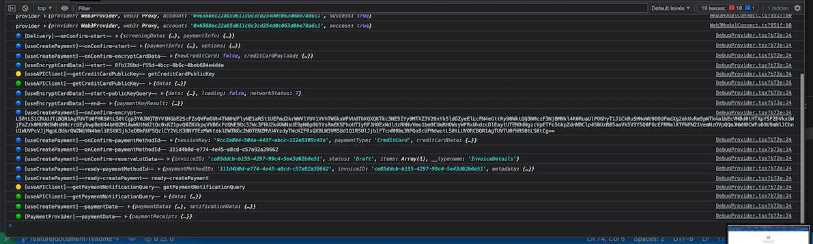

<br />


<h1 align="center">🍸 Mojito Mixers</h1>

<br /><br />


<p align="center">
  👨‍💻 React components for the Mojito Platform, Reference App and third-party projects, including Mojito's Checkout / Payment UI  and payment sandbox / test app to easily test credit card, ACH, Wire and Crypto payments with Circle, 3DS, Plaid, Vertex and TaxJar integrations.
</p><p align="center">
  🚀 Check it out at <a href="https://payments-staging.mojito.xyz/" target="_blank">https://payments-staging.mojito.xyz/</a>!
</p>

<br />


<p align="center">
  <a href="https://www.npmjs.com/package/@mojitonft/mojito-mixers" target="_blank">
    
  </a>
</p>

<br />


<p align="center">
  <a href="https://payments-staging.mojito.xyz/" target="_blank">
    
  </a>
</p>

<br />


## Using this library in your project

You can install this project with one of these commands:

    npm install --save @mojitonft/mojito-mixers
    yarn add @mojitonft/mojito-mixers

Alternatively, once you've built the library using `yarn dist:build`, you can install it locally in another project adding
this line to your `package.json`'s dependencies. If you update it, make sure you remove the entry from `yarn.lock` and
re-install it.

    "@mojitonft/mojito-mixers": "file:../mojito-mixers"

Also, make sure you install the following dependencies:

    react
    react-dom
    @mui/material

And also, keep in mind:

- `@emotion/react` is not needed.

- `@emotion/styled` is needed as stated in [MUI's docs](https://mui.com/guides/interoperability/):

    > Keep `@emotion/styled` as a dependency of your project. Even if you never use it explicitly, it's a peer dependency of `@mui/material`.

- `styled-components` is needed as stated in [`react-payment-inputs`' docs](https://github.com/medipass/react-payment-inputs#using-the-built-in-styled-wrapper), but it's not used:

    > Note: <PaymentInputsWrapper> requires styled-components to be installed as a dependency.
    >
    > By default, React Payment Inputs does not have built-in styling for it's inputs. However, React Payment Inputs comes with a styled wrapper which combines the card number, expiry & CVC fields...

<br />


## Usage:

Fist, you need to create a `CheckoutComponent: React.FC<PUICheckoutProps>` component that renders `MojitoCheckout`
and passes it all required props. Simply copy the following file and adapt it to your needs:

You can find an example here: [app/src/layout/CheckoutLayout.tsx](./app/src/layout/CheckoutLayout.tsx).

You'll use this `CheckoutComponent` component in your code instead of `MojitoCheckout` just so that you don't have to
repeat properties that rarely change, like the theme  [DefaultThemes](#theme)


```
import { useAuth0 } from '@auth0/auth0-react';
import { MojitoCheckout } from '@mojitonft/mojito-mixers';


  const { isAuthenticated, getIdTokenClaims } = useAuth0();
  const theme = {
            font: {
              primary: 'Sneak',
              secondary: 'Sneak',
            },
            color: {
              primary: '#6663FD',
              secondary: '#FFFFFF',
              background: '#FAFAFC',
              errorBackground: '#FEE3E5',
              text: '#000000',
              cardBackground: '#FFFFFF',
              checkout: {
                continueButtonBackground: '#6663FD',
                continueButtonTextColor: '#FFFFFF',
              },
              placeholder: '#BABEC5',
              costBreakdown: {
                applyButtonBackground: '#DADAE9',
                applyButtonTextColor: '#FFFFFF',
              },
            },
          };

  const getAuthenticationToken = useCallback(async () => {
    const token = await getIdTokenClaims();
    return token?.__raw || '';
  }, [getIdTokenClaims]);

  const handleClickGoToMarketPlace = useCallback(async () => {
  }, []);

  
  <MojitoCheckout
    uri={ undefined }
    apolloClient={ undefined }
    checkoutOptions={{
      orgId: 'd086ea16-d40d-454c-84a4-64b5e940670a',
      lotId: '17cd1000-323d-4a20-8e5f-7a8598ffae2a',
      quantity: 1,
      paymentId,
      collectionItemId: '64e99437-ac2e-45bc-b4a6-4750985b4e81',
      discountCode: 'ZZTO',
    }}
    theme={ theme }
    uiConfiguration={
      billing: {
        isEnableExpressCheckout: true,
        gpay: true,
        applepay: true,
        walletConnect: true,
        metaMask: true,
      },
      payment: {
        creditCard: true,
        gpay: true,
        applepay: true,
        walletConnect: true,
        wire: true,
      },
      costBreakdown: {
        showDiscountCode: true
      },
      paymentConfirmation: {
        onGoToMarketPlace: handleClickGoToMarketPlace,
      },
    }
    show={ show }
    getAuthenticationToken={ getAuthenticationToken } />
```
<br />

### Checkout Options

 
```
  <MojitoCheckout
      checkoutOptions={{
        orgId: 'd086ea16-d40d-454c-84a4-64b5e940670a',
        lotId: '17cd1000-323d-4a20-8e5f-7a8598ffae2a',
        quantity: 1,
        paymentId: '<payment id>',
        collectionItemId: '64e99437-ac2e-45bc-b4a6-4750985b4e81',
        discountCode: 'ZZTO',
        vertexEnabled: false,
      }} />
```
### Address Validation & Tax Calculation with Vertex or TaxJar

If you'd like address to be validated and taxes to be calculated during the checkout process, particularly in the Billing
Information step, you need a Vertex or TaxJar account. Once you have it, you need to configure it in Mojito Mint.

Alternatively, set the following prop to disable those calls to the backend: `vertexEnabled = false`.
  
<br />
  

### Supported Countries

We use Circle for payments, so the supported countries depend on which payment method is going to be used, as described here:

- https://developers.circle.com/docs/supported-countries

<br />
  


### (Secret) Debug Mode

If you quickly click the logo in the top-right corner 16 times, the debug mode will be enabled (toggled, actually), even in production and regardless of
the initial value you passed for the `debug` prop.

The debug mode will, among logging/displaying some other less relevant pieces of data:

<br />


- Show form values and errors as JSON below the form:

  
  <br />
  

<br />

<br />

### Theme
You can use the themeOptions or theme props to pass a custom theme or theme options object:

themeOptions (preferred) will merge Mojito's default theme with your custom one

If none is provided, the default Mojito theme will be used.

```
const DefaultThemes: ThemeConfiguration = {
  font: {
    primary: 'Sneak',
    secondary: 'Sneak',
  },
  color: {
    primary: '#6663FD',
    secondary: '#FFFFFF',
    background: '#FAFAFC',
    errorBackground: '#FEE3E5',
    text: '#000000',
    cardBackground: '#FFFFFF',
    checkout: {
      continueButtonBackground: '#6663FD',
      continueButtonTextColor: '#FFFFFF',
    },
    placeholder: '#BABEC5',
    costBreakdown: {
      applyButtonBackground: '#DADAE9',
      applyButtonTextColor: '#FFFFFF',
    },
  },
};

```

Note that using MUI's ThemeProvider from your project won't work as expected and you will end up seeing Mojito's default theme:

```
<MojitoCheckout theme={ theme }
```